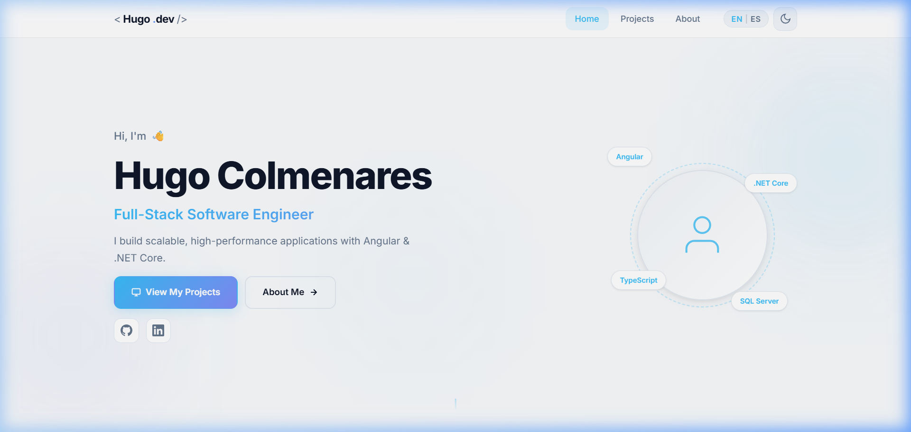
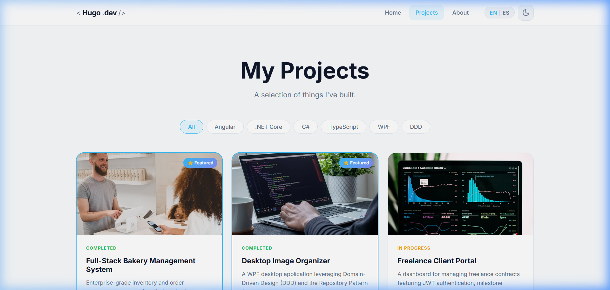
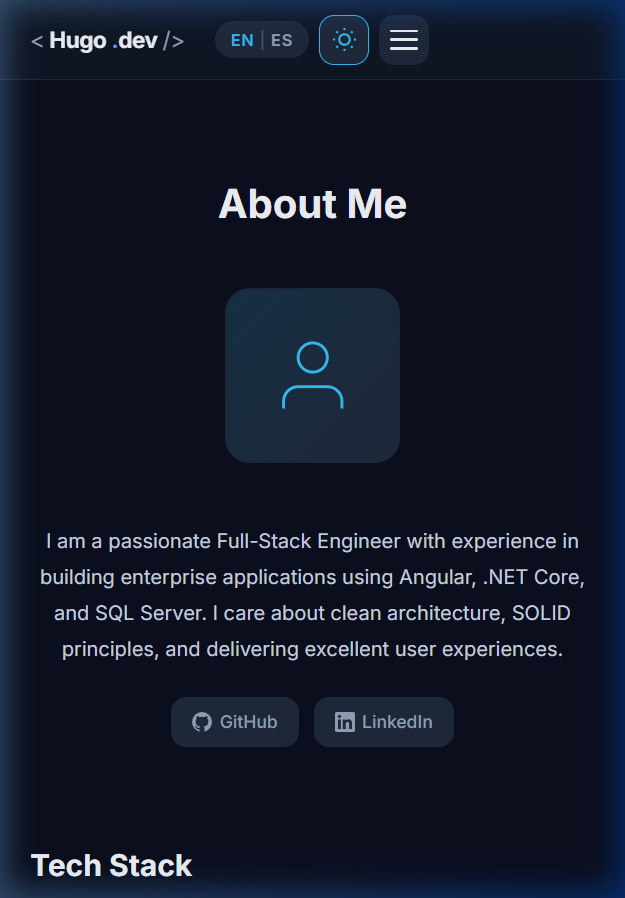
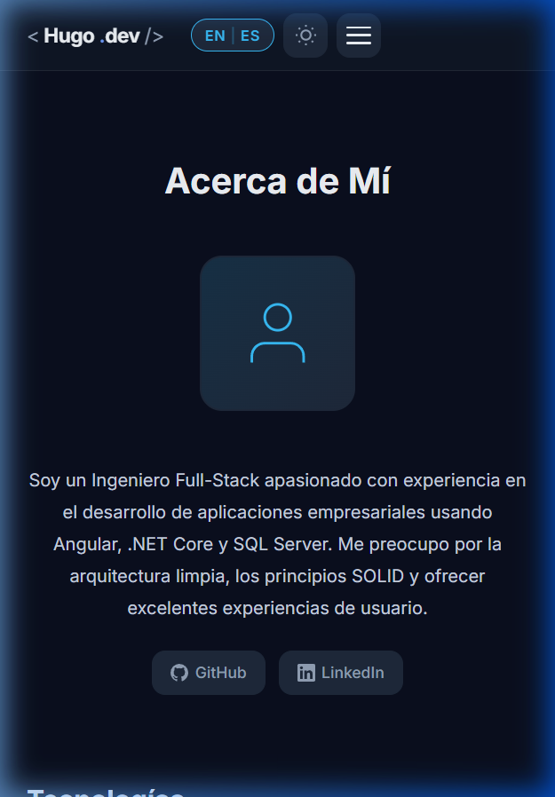

# WebPortafolio — Hugo Colmenares

This is the professional portfolio of **Hugo Fernando Colmenares**, a Full-Stack Software Engineer specializing in Angular, .NET Core, and modern web technologies. 

The project was generated using [Angular CLI](https://github.com/angular/angular-cli) version 19.2.7 and strictly follows a standalone component architecture, Signal-based reactivity, and a mobile-first design approach.

## Features

- **Angular 19 Standalone Architecture**: No `NgModules`, fully modern implementation.
- **Signals Reactivity**: State management for i18n (Internationalization) and Dark/Light modes is handled using Angular Signals.
- **Mobile-First & Responsive**: Custom CSS foundation using the 62.5% REM trick and custom variables.
- **i18n (English / Spanish)**: Real-time language switching without page reloads.
- **Dark Mode**: Fully supported dark/light themes.

---

## Preview Screenshots

### Home Page (Light Mode)


### Projects Page


### About Page (Dark Mode)


### About Page (Spanish)


---

## Development server

To start a local development server, run:

```bash
ng serve
```

Once the server is running, open your browser and navigate to `http://localhost:4200/`. The application will automatically reload whenever you modify any of the source files.

## Project Structure

```text
src/
└── app/
    ├── core/                 # Singleton services, models (ThemeService, TranslationService, etc.)
    ├── pages/                # Routable view components (Home, Projects, About, Layout shell)
    ├── shared/               # Reusable UI components (ProjectCard, TechBadge, Button, Header, Sidebar, Footer)
    ├── app.routes.ts         # Application routing handling lazy loading
    └── app.config.ts         # Global providers
```

## Building

To build the project run:

```bash
ng build
```

This will compile your project and store the build artifacts in the `dist/` directory. By default, the production build optimizes your application for performance and speed.

## Author

<table>
<tr>
<td align="center">
  <a href="https://github.com/HugoFernandoColmenares">
    
    <br />
    <sub><b>Hugo Colmenares</b></sub>
  </a>
  <br />
  💻 Developer
</td>
</tr>
</table>
